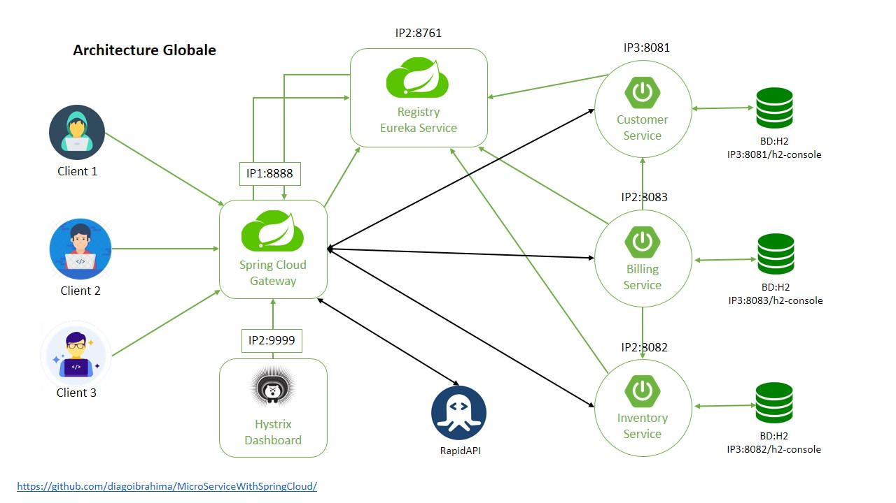

# MicroServiceWithSpringCloud
Création de la partie backend d’un exemple d’application basée sur des micro-service en utilisant Spring cloud

1. Création des micros-service métiers en mode express basés sur JPA, Spring Data, Spring Data Rest, H2 Data base, Open Feign
    - Customer Service
    - Inventory Service
    - Billing Service
	
2. Développement et mise en place du Discovery Service Netflix Eureka Service

3. Développement d'un service proxy orchestration avec Spring Cloud Gateway avec les trois modes de routage :
    - Routage Statique avec Configuration déclarative application.yml
    - Routage statique avec Configuration programmatique (Classe de configuration)
    - Routage Dynamique en s’appuyant sur le service d’enregistrement Eureka Discovery. 
	
4. Utilisation des services de spring cloud 
	- Actuator pour le monitoring et le management des services
	- Hystrix pour Circuit Breaker 
	- Hystrix Dash Board

Mot clés : Java, JEE, Spring, Spring Cloud, Micro services, Spring Cloud Gateway, Eureka Discovery service, Hystrix, Circuit Breaker
